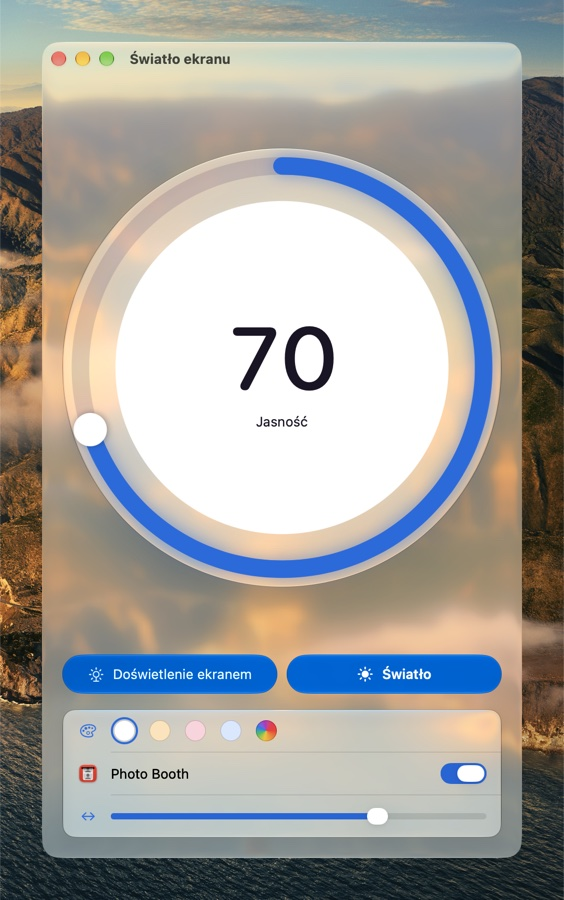
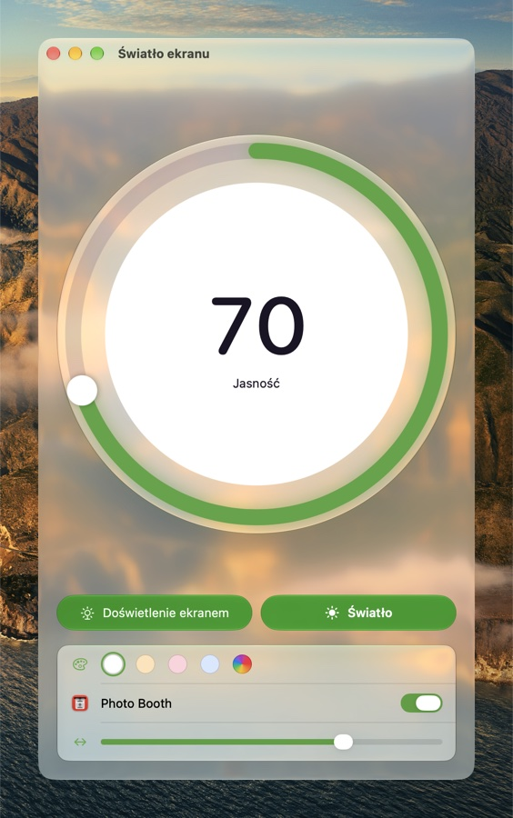
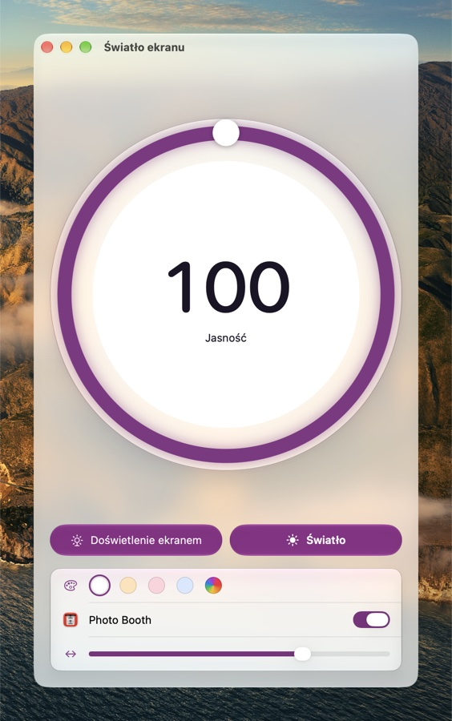

# Screen Light (Światło ekranu)

A fill light made of your Mac's screen, for video calls and photos. Pick a brightness and a
color, click **Light**, and the whole screen glows in that color while the backlight goes to the
level you chose. Any key or click turns it off and brings the old brightness back.

*[Po polsku niżej.](#po-polsku)*

<p>
  
  
  
  
</p>

*The look follows System Settings → Appearance: purple, blue and green accent colors, and the
Liquid Glass slider moved to tinted on the right.*

## Download and install

1. Download [Screen-Light.zip](https://github.com/EnderNoch/Screen-Light/raw/main/Screen-Light.zip).
2. Open the zip file.
3. Drag **Screen Light.app** into the Applications folder.

Requires macOS 26 or later on a Mac with Apple silicon.

### First launch

The app isn't notarized by Apple, so macOS blocks it the first time:

1. Double-click **Screen Light.app** — a warning appears; close it.
2. Open **System Settings → Privacy & Security**.
3. Scroll down to the message about Screen Light and click **Open Anyway**.

You only need to do this once.

## What it does

- **Light** — the whole screen (and every connected display) glows in the chosen color.
- **Edge Light** — a band of light around the edges of the screen, modeled on the system's Edge
  Light: it doesn't cover your work, clicks go through it, and it fades around the pointer. A
  slider sets its width.
- **Photo Booth** — while Photo Booth is in front, the edge light turns on by itself around the
  preview, other displays light up fully, and everything goes off when you leave Photo Booth.
- **Brightness dial** — drag along the ring, or click the number and type a value.
- **Colors** — white, warm, pink, cool, or any color from the system color panel.
- **Menu bar** — brightness, colors and both lights at hand. Hide the icon the system way:
  System Settings → Menu Bar → Allow in the Menu Bar.
- **Everything from the system** — language (43 languages), light and dark appearance, accent
  color, the Liquid Glass slider and the icon style (Default, Dark, Clear, Tinted). The app has
  no switches of its own where the system already has one, and changes in Settings show at once.
- **Opens at login** from the first launch; turn that off in System Settings → General → Login
  Items.

The light itself doesn't show up in screenshots — just like the system's Edge Light.

## Building from source

Requires Xcode (for `actool`, which builds the icon):

```bash
./build.sh
```

The script compiles `Sources/`, builds the icon from the `ScreenLight.icon` layers, signs the
app ad hoc, refreshes `Screen-Light.zip` and installs the app in `/Applications` (a running copy
is quit and the new one opened).

| Part | File |
| --- | --- |
| App, window and menu bar (SwiftUI `Window` + `MenuBarExtra`) | `Sources/ScreenLightApp.swift` |
| Settings (`@Observable`, UserDefaults), system accent, login item (`SMAppService`) | `Sources/Model.swift` |
| Backlight, light windows, Edge Light, Photo Booth | `Sources/Light.swift` |
| Window and menu bar panel | `Sources/Views.swift` |
| Translations (the app's name in each language is in `build.sh`) | `Sources/Strings.swift` |
| Icon from Icon Composer | `ScreenLight.icon` |

The backlight is set through the private `DisplayServices` framework (Apple silicon has no public
API for it) and applies to the built-in display; external displays light up with the picture only.

## License

All rights reserved — see [LICENSE](LICENSE). You may download and use the app; the code may not
be copied, redistributed, modified or used to train AI models.

Part of [Atypical Maker Mac Apps](https://github.com/EnderNoch/Atypical-Maker-Mac-Apps).

---

## Po polsku

**Światło ekranu** to lampa doświetlająca z ekranu Maca, do rozmów wideo i zdjęć. Ustawiasz
jasność i kolor, klikasz **Światło** — cały ekran świeci tym kolorem, a podświetlenie idzie na
wybrany poziom. Dowolny klawisz albo kliknięcie gasi światło i przywraca poprzednią jasność.

### Pobieranie i instalacja

1. Pobierz [Screen-Light.zip](https://github.com/EnderNoch/Screen-Light/raw/main/Screen-Light.zip).
2. Otwórz plik zip.
3. Przeciągnij **Screen Light.app** do folderu Aplikacje.

Wymaga macOS 26 lub nowszego na Macu z procesorem Apple. Przy pierwszym uruchomieniu macOS
zablokuje aplikację, bo nie jest notaryzowana: kliknij ją dwukrotnie, zamknij ostrzeżenie,
otwórz **Ustawienia systemowe → Prywatność i ochrona**, przewiń w dół i kliknij
**Otwórz mimo to**. Wystarczy raz.

### Co potrafi

- **Światło** — cały ekran (i każdy podłączony monitor) świeci wybranym kolorem.
- **Doświetlenie ekranem** — pas światła wokół krawędzi, wzorowany na systemowym: nie zasłania
  pracy, kliknięcia przez niego przechodzą, a przy kursorze gaśnie. Grubość ustawiasz suwakiem.
- **Photo Booth** — gdy Photo Booth jest na wierzchu, ramka włącza się sama, inne ekrany świecą
  w całości, a po wyjściu z Photo Booth wszystko gaśnie.
- **Tarcza jasności** — przeciągasz po pierścieniu albo klikasz liczbę i wpisujesz wartość.
- **Kolory** — biały, ciepły, różowy, chłodny albo dowolny z systemowego panelu kolorów.
- **Pasek menu** — jasność, kolory i oba rodzaje światła pod ręką; ikonę chowa się w
  Ustawieniach systemowych → Pasek menu → Pozwalaj na pasku menu.
- **Wszystko z systemu** — język, jasny i ciemny wygląd, kolor akcentu, suwak Liquid Glass i styl
  ikony; zmiany w Ustawieniach widać od razu.
- **Otwiera się przy logowaniu** od pierwszego uruchomienia; wyłączasz w Ustawieniach
  systemowych → Ogólne → Rzeczy otwierane podczas logowania.

### Licencja

Wszelkie prawa zastrzeżone — patrz [LICENSE](LICENSE). Aplikację wolno pobrać i używać; kodu nie
wolno kopiować, rozpowszechniać, zmieniać ani używać do trenowania modeli AI.
